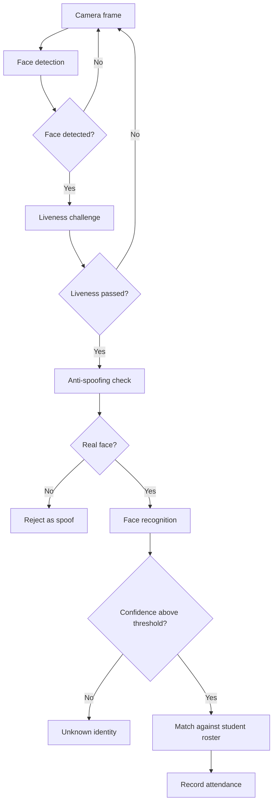

# Face Attendance System with Liveness Detection and Anti-Spoofing

I developed this project for a Digital Image Processing course. It records attendance through face recognition and adds liveness and anti-spoofing checks to reduce attempts made with a photograph.

The main application uses a Tkinter desktop interface. I also kept separate test scripts for face recognition and anti-spoofing so that each part of the vision pipeline can be checked on its own.

> This public repository does not include student photographs, real identity records, attendance history, class mappings containing names, or recognition models trained with those records. See the [privacy notes](docs/PRIVACY.md) for details.

## How it works



The checks are performed in stages. A face reaches identity recognition only after it passes the liveness and anti-spoofing steps. Attendance is then stored by session and can be exported as a CSV or Excel report.

## Repository structure

```text
.
├── run_gui.py              # desktop application entry point
├── src/                    # main programs and component tests
├── models/                 # local model location and configuration
├── database/               # example student-record structure
├── dataset/                # local recognition dataset
├── notebooks/              # image-processing pipeline demonstration
├── examples/               # optional local sample image
├── scripts/check_setup.py  # checks required local files
└── docs/PRIVACY.md         # privacy and publication notes
```

## Setup

Clone the repository and enter the project directory:

```bash
git clone https://github.com/femieljmt/face-attendance-anti-spoofing.git
cd face-attendance-anti-spoofing
```

Create a virtual environment.

Windows PowerShell:

```powershell
python -m venv .venv
.\.venv\Scripts\Activate.ps1
```

Linux or Raspberry Pi:

```bash
python3 -m venv .venv
source .venv/bin/activate
```

Install the dependencies:

```bash
python -m pip install --upgrade pip
python -m pip install -r requirements.txt
```

Some Linux distributions require Tkinter to be installed separately through the system package manager.

The virtual environment is not committed because it is large and platform-specific. If the original working environment is still available, its package versions can be recorded with:

```powershell
python -m pip freeze > requirements-lock-windows.txt
```

## Local files required for recognition

Before running recognition, place the trained models and class-index files in `models/`. The expected filenames are listed in [models/README.md](models/README.md).

The face dataset and student roster must also be prepared locally. See [dataset/README.md](dataset/README.md) for the directory layout and [database/README.md](database/README.md) for the student-record format.

Check the setup with:

```bash
python scripts/check_setup.py
```

## Running the application

The simplest entry point is:

```bash
python run_gui.py
```

This opens the attendance-session interface and starts the backend in `src/final_attendance_lightweight_raspi.py`.

The original GUI script can also be started directly:

```bash
python src/attendance_gui_tkinter_session_v8_best_confidence.py
```

Example backend command for the `PCD` class using camera index `0`:

```bash
python src/final_attendance_lightweight_raspi.py --kelas PCD --camera 0
```

The current source supports the class labels `PCD`, `TA`, `Pempros`, and `PSD`.

To run face recognition without anti-spoofing:

```bash
python src/final_attendance_lightweight_raspi.py --kelas PCD --camera 0 --recognition_only
```

## Testing individual components

Anti-spoofing webcam test:

```bash
python src/test_antispoof_mobilenet_webcam_v2.py --camera 0
```

Face-recognition webcam test:

```bash
python src/test_mobilenet_recognition_only.py --kelas PCD --camera 0
```

Change `--camera` if the intended camera is not available at index `0`.

## Jupyter Notebook

[`notebooks/01_computer_vision_pipeline_demo.ipynb`](notebooks/01_computer_vision_pipeline_demo.ipynb) demonstrates dependency checks, image preprocessing, model discovery, and an anti-spoofing example using a still image.

The notebook is not a replacement for the desktop application. Webcam loops, Tkinter state, subprocesses, and attendance sessions are handled more reliably by the Python scripts.

## Limits of the public repository

The source code and application design can be studied from this repository, but recognition cannot be reproduced from a fresh clone alone. It still requires private recognition models, class mappings, a face dataset, and a student roster.

The original model-training scripts and an exact dependency lock file are also not included. This distinction is important: running the application source and reproducing the full model-training process are separate tasks.

## Privacy

Do not upload the following files to a public repository:

- real face images;
- student names or identification numbers;
- attendance records and session reports;
- `class_indices_*.json` files containing real identities;
- face-recognition models that have not been approved for public release;
- virtual environments, cache files, and runtime-generated data.

The repository's `.gitignore` file is configured to exclude these files.
