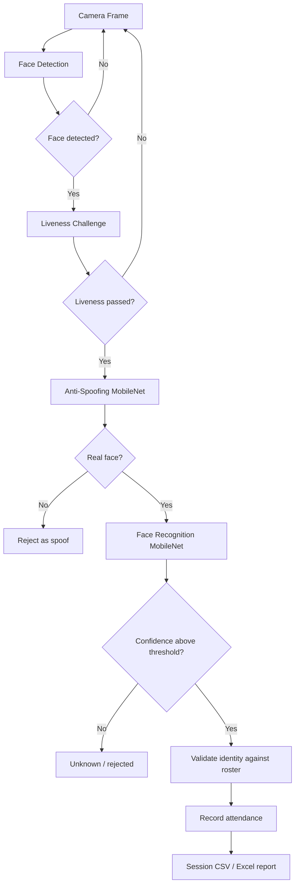

# Realtime Face Attendance System with Liveness Detection and Anti-Spoofing

A computer-vision attendance application that combines **face detection**, **liveness challenges**, **MobileNet-based anti-spoofing**, **MobileNet-based face recognition**, and **session-based attendance reporting**.

The project was developed as a Digital Image Processing project and includes a Tkinter desktop interface plus standalone scripts for testing recognition and anti-spoofing components.

> **Privacy note:** the public-ready package intentionally excludes real student rosters, face datasets, attendance history, class-index files containing student identities, and trained face-recognition models. See [`docs/PRIVACY.md`](docs/PRIVACY.md).

## System Pipeline



## Main Components

```text
.
├── run_gui.py
├── requirements.txt
├── src/
│   ├── attendance_gui_tkinter_session_v8_best_confidence.py
│   ├── final_attendance_lightweight_raspi.py
│   ├── final_liveness_recognition_only_no_antispoof.py
│   ├── test_antispoof_mobilenet_webcam_v2.py
│   ├── test_mobilenet_recognition_only.py
│   └── utility scripts...
├── models/
│   ├── README.md
│   ├── anti_spoofing_threshold.json
│   └── class_indices.example.json
├── database/
│   ├── README.md
│   └── mahasiswa_gui.example.csv
├── dataset/
│   └── README.md
├── notebooks/
│   └── 01_computer_vision_pipeline_demo.ipynb
├── scripts/
│   └── check_setup.py
└── docs/
    └── PRIVACY.md
```

## Why the Virtual Environment Is Not Included

A Python virtual environment can easily occupy hundreds of megabytes or more than 1 GB. It should **not** be committed to Git. The environment is rebuilt from dependency metadata instead.

This package contains a `requirements.txt` listing the direct third-party dependencies inferred from the supplied source code. The exact package versions could not be reconstructed because the original environment was not part of the supplied archive.

If you still have the working environment, generate a version snapshot before publishing:

```powershell
python -m pip freeze > requirements-lock-windows.txt
```

Or, while that environment is activated, run:

```powershell
.\scripts\export_environment.ps1
```

That file gives other users a much better chance of reproducing the exact working environment.

## Setup

### 1. Clone the repository

```bash
git clone <your-repository-url>
cd <repository-folder>
```

### 2. Create a virtual environment

Windows PowerShell:

```powershell
python -m venv .venv
.\.venv\Scripts\Activate.ps1
```

Linux / Raspberry Pi:

```bash
python3 -m venv .venv
source .venv/bin/activate
```

### 3. Install dependencies

```bash
python -m pip install --upgrade pip
python -m pip install -r requirements.txt
```

Tkinter is included with many Windows Python installations. On Linux it may need to be installed through the operating-system package manager.

### 4. Add your private model files

Copy the trained models and real class-index mappings from your working project into `models/`. The expected filenames are documented in [`models/README.md`](models/README.md).

You can check the setup with:

```bash
python scripts/check_setup.py
```

### 5. Prepare the roster and dataset locally

Real face datasets and student rosters are not tracked by Git. Create or restore your local data under `dataset/recognition/` and `database/` as required by your trained recognition models.

## Run the Desktop Application

The simplest entry point is:

```bash
python run_gui.py
```

This starts the Tkinter session GUI. Internally, the GUI launches the attendance backend from `src/final_attendance_lightweight_raspi.py`.

You can also run the original GUI script directly:

```bash
python src/attendance_gui_tkinter_session_v8_best_confidence.py
```

## Run the Backend Directly

Example for class `PCD` using camera index `0`:

```bash
python src/final_attendance_lightweight_raspi.py --kelas PCD --camera 0
```

Supported class labels in the supplied source are:

- `PCD`
- `TA`
- `Pempros`
- `PSD`

Recognition-only mode:

```bash
python src/final_attendance_lightweight_raspi.py --kelas PCD --camera 0 --recognition_only
```

## Component Tests

Anti-spoofing webcam test:

```bash
python src/test_antispoof_mobilenet_webcam_v2.py --camera 0
```

Recognition-only webcam test:

```bash
python src/test_mobilenet_recognition_only.py --kelas PCD --camera 0
```

## Jupyter Notebook

The application itself remains a normal Python/Tkinter application because webcam loops, desktop GUI state, subprocess execution, and attendance sessions are better handled by `.py` files.

A notebook is included as a **technical demonstration**, not as a replacement for the application:

```text
notebooks/01_computer_vision_pipeline_demo.ipynb
```

It documents dependency checks, image preprocessing, private model discovery, and a static-image anti-spoofing example that can be run after you provide your own sample image and local model file.

## Data and Model Publication Policy

Do not commit:

- `.venv/`;
- real face images;
- real student rosters;
- attendance/session CSV files;
- `class_indices_*.json` containing real identities;
- private trained face-recognition models;
- backup ZIP files or runtime history.

The supplied `.gitignore` already excludes these categories.

## Current Reproducibility Limitations

The provided archive did not include:

1. the original virtual environment or an exact dependency lock file;
2. model-training scripts referenced by comments in the application;
3. a public-safe sample face image;
4. authorization/provenance documentation for publishing the trained model binaries.

Therefore this repository package is suitable for publishing the **application source and project design**, while exact model reproduction still depends on private development artifacts.

## Suggested Next Improvements

- export the exact working environment to `requirements-lock-windows.txt`;
- add training/evaluation scripts if they are available;
- add screenshots of the GUI using fictional or consented data;
- add quantitative recognition and anti-spoofing evaluation results;
- gradually split the large GUI/backend modules into smaller `vision`, `attendance`, and `gui` modules without changing working behavior.
