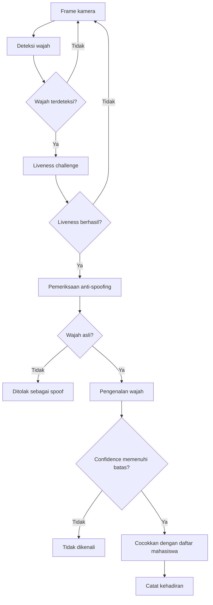

#Sistem Absensi Wajah dengan Liveness dan Anti-Spoofing

Repository ini berisi proyek Pengolahan Citra Digital yang saya kerjakan untuk membuat sistem absensi berbasis pengenalan wajah. Selain mengenali identitas, sistem juga memakai liveness challenge dan model anti-spoofing untuk mengurangi kemungkinan absensi menggunakan foto wajah.

Aplikasi utamanya menggunakan antarmuka desktop Tkinter. Saya juga menyertakan beberapa script pengujian supaya proses pengenalan wajah dan anti-spoofing dapat diperiksa secara terpisah.

> Repository publik ini tidak menyertakan foto mahasiswa, daftar identitas asli, riwayat absensi, pemetaan kelas yang memuat nama, atau model pengenalan wajah yang dilatih menggunakan data tersebut. Penjelasannya tersedia pada [catatan privasi](docs/PRIVACY.md).

## Alur sistem



Urutannya dibuat berlapis. Wajah baru diteruskan ke pengenalan identitas setelah liveness dan anti-spoofing berhasil. Hasil absensi kemudian disimpan berdasarkan sesi dan dapat dibuat menjadi laporan CSV atau Excel.

## Struktur repository

```text
.
├── run_gui.py              # entry point aplikasi desktop
├── src/                    # program utama dan script pengujian
├── models/                 # konfigurasi dan lokasi model lokal
├── database/               # contoh struktur data mahasiswa
├── dataset/                # lokasi dataset pengenalan wajah
├── notebooks/              # demonstrasi pipeline citra
├── examples/               # lokasi gambar contoh lokal
├── scripts/check_setup.py  # pemeriksaan file yang dibutuhkan
└── docs/PRIVACY.md         # catatan privasi data
```

## Persiapan

Clone repository, lalu masuk ke folder proyek:

```bash
git clone https://github.com/femieljmt/face-attendance-anti-spoofing.git
cd face-attendance-anti-spoofing
```

Buat virtual environment.

Windows PowerShell:

```powershell
python -m venv .venv
.\.venv\Scripts\Activate.ps1
```

Linux atau Raspberry Pi:

```bash
python3 -m venv .venv
source .venv/bin/activate
```

Pasang dependency:

```bash
python -m pip install --upgrade pip
python -m pip install -r requirements.txt
```

Pada beberapa distribusi Linux, Tkinter perlu dipasang melalui package manager sistem.

Virtual environment tidak dimasukkan ke repository karena ukurannya besar dan isinya bergantung pada sistem operasi. Jika environment proyek yang asli masih tersedia, daftar versi package dapat disimpan dengan:

```powershell
python -m pip freeze > requirements-lock-windows.txt
```

## Menyiapkan file lokal

Sebelum recognition dijalankan, tempatkan model dan file indeks kelas milik proyek di folder `models/`. Daftar nama file yang dibaca program tersedia pada [models/README.md](models/README.md).

Dataset wajah dan daftar mahasiswa juga harus disiapkan secara lokal. Gunakan [dataset/README.md](dataset/README.md) untuk susunan folder dan [database/README.md](database/README.md) untuk struktur data mahasiswa.

Periksa kelengkapan setup dengan:

```bash
python scripts/check_setup.py
```

## Menjalankan aplikasi

Entry point yang paling sederhana adalah:

```bash
python run_gui.py
```

Perintah tersebut membuka GUI sesi absensi dan menjalankan backend dari `src/final_attendance_lightweight_raspi.py`.

GUI asli juga dapat dijalankan langsung:

```bash
python src/attendance_gui_tkinter_session_v8_best_confidence.py
```

Contoh menjalankan backend untuk kelas `PCD` dengan kamera indeks `0`:

```bash
python src/final_attendance_lightweight_raspi.py --kelas PCD --camera 0
```

Label kelas yang tersedia pada source saat ini adalah `PCD`, `TA`, `Pempros`, dan `PSD`.

Untuk menjalankan pengenalan wajah tanpa anti-spoofing:

```bash
python src/final_attendance_lightweight_raspi.py --kelas PCD --camera 0 --recognition_only
```

## Menguji komponen secara terpisah

Anti-spoofing melalui webcam:

```bash
python src/test_antispoof_mobilenet_webcam_v2.py --camera 0
```

Pengenalan wajah saja:

```bash
python src/test_mobilenet_recognition_only.py --kelas PCD --camera 0
```

Jika kamera utama tidak berada pada indeks `0`, ubah nilai `--camera`.

## Jupyter Notebook

File [`notebooks/01_computer_vision_pipeline_demo.ipynb`](notebooks/01_computer_vision_pipeline_demo.ipynb) saya sediakan untuk menjelaskan dependency, preprocessing citra, pencarian model, dan contoh anti-spoofing pada gambar statis.

Notebook tersebut bukan pengganti aplikasi utama. Webcam loop, antarmuka Tkinter, subprocess, dan pengelolaan sesi lebih sesuai dijalankan melalui file Python biasa.

## Batas penggunaan repository publik

Source code dan rancangan aplikasi dapat dipelajari dari repository ini, tetapi hasil recognition belum dapat direproduksi hanya dengan melakukan clone. Pengguna tetap memerlukan model pengenalan, pemetaan kelas, dataset, dan daftar mahasiswa yang tidak dipublikasikan karena memuat atau berasal dari data biometrik.

Script pelatihan model dan versi dependency yang benar-benar digunakan pada environment awal juga belum tersedia pada paket ini. Catatan ini membedakan antara menjalankan source aplikasi dan mereproduksi proses pelatihan model.

## Privasi

Jangan memasukkan file berikut ke repository publik:

- foto wajah asli;
- daftar nama atau nomor mahasiswa;
- laporan dan riwayat absensi;
- `class_indices_*.json` yang memuat identitas nyata;
- model pengenalan wajah yang publikasinya belum mendapat izin;
- virtual environment, cache, dan file hasil runtime.

Aturan `.gitignore` pada repository sudah disiapkan untuk mengecualikan kategori tersebut.
